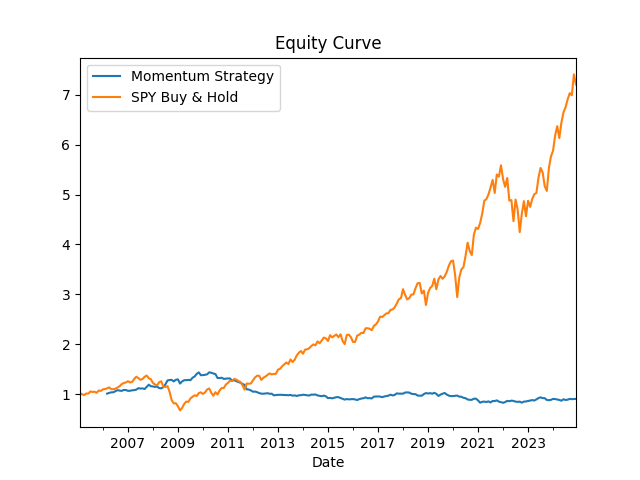

# Momentum-Research : Survivorship–Bias–Free 12–1 Momentum in the S&P 500 (2005–2024)

  
  
  

A **fully reproducible replication study** of the canonical **12–1 month cross-sectional momentum strategy** in the S&P 500.  
This project covers **January 2005 – December 2024**, and makes three contributions:

1. **Bias-free replication** – Rebuilds historical S&P 500 membership to eliminate survivorship/look-ahead bias.  
2. **Realistic frictions** – Applies a turnover-based transaction cost model calibrated at 10 bps per side.  
3. **Robust risk analysis** – Evaluates alphas under CAPM, Fama–French (3/5), and FF5+Momentum (UMD) with Newey–West errors.  

All code is released under the MIT license. Nothing herein constitutes investment advice.  

▶ **No API keys required.** Data download uses `yfinance`; a small CSV ships in `data/` for offline tests.  

---

## 🔑 Key Features

| Feature | What it does | Why it matters |
|---------|--------------|----------------|
| **Survivorship-bias–free universe** | Reconstructs dated S&P 500 additions/deletions | Matches real-time investability |
| **Turnover-based cost model** | Computes monthly $ turnover × 10 bps | Captures true implementation frictions |
| **Factor regressions** | CAPM, FF3, FF5, FF5+UMD with HAC SEs | Tests for residual alpha beyond momentum |
| **Auto-generated tables/figures** | Results pipeline fully scripted | Guarantees transparency & reproducibility |

---

## 📈 Results Snapshot

  

*Figure 1 – 12–1 momentum vs. U.S. market, net of 10 bps turnover costs.*  

- Net annualized return: **–2.07%**  
- Sharpe ratio: **–0.34**  
- Max drawdown: **–61%**  
- FF5+UMD alpha: **–4.0% (t = –3.2)**  

---

---

## 📖 Citation

> **Sathish Kumar, D.** (2025). _Momentum-Research: Survivorship–Bias–Free 12–1 Momentum in the S&P 500 (Version 1.0.0)_. Zenodo. https://doi.org/10.5281/zenodo.16702629  

A separate DOI for the working paper is listed under **Related Identifiers** in the Zenodo record.  

---

## ⚖️ License

This project is licensed under the **MIT License** – see [`LICENSE`](LICENSE) for details.  

